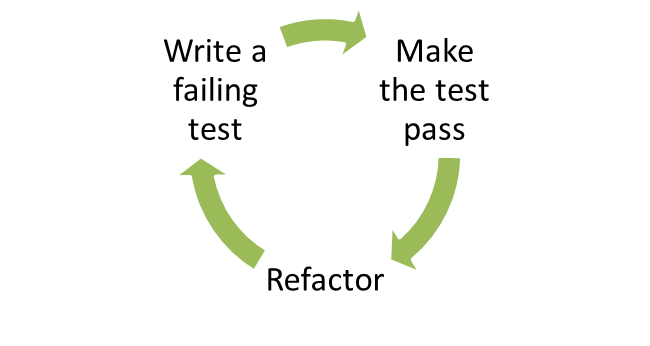

home: index.html
prev: maintainability2.html
next: detail1.html
---
# 4. Testing

**TDD?** The best way to make code testable is to start by writing the tests first - TDD style. Essentially, [TDD](http://en.wikipedia.org/wiki/Test-driven_development) boils down to:



TDD is a set of rules for writing code: you write a failing test (red), then add just enough code to make it pass (green) and finally refactor where necessary (refactor).

In this chapter, we discuss how to set up testing for your project using Mocha, how to do dependency injection for your CommonJS modules, and how you can test asynchronous code. The rest is best covered by some other book or tutorial; so if you haven't heard of TDD, get out from under that rock you've been living under and read [Kent Beck's book](https://www.google.com/search?q=test+driven+development+by+example) and perhaps [Michael Feather's book](https://www.google.com/search?q=working+effectively+with+legacy+code).

## Why write tests?

Test driven development is not valuable because it catches errors, but because it changes the way you think about interfaces between modules. Writing tests _before you write code_ influences how you think about the public interface of your modules and their coupling, it provides a safety net for performing refactoring and it documents the expected behavior of the system.

In most cases, you don't completely understand the system when you start writing it. Writing something once produces just a rough draft. You want to be able to improve the code while ensuring that existing code does not break. That's what tests are for: they tell you what expectations you need to fulfill while refactoring.

## What to test?

Test _driven_ development implies that tests should guide the development. I often use tests as TODO's when developing new functionality; no code is written until I know how the code should look like in the test. Tests are a contract: this is what this particular module needs to provide externally.

I find that the greatest value comes from testing pure logic and otherwise-hard-to-replicate edge cases. I tend not to test internal details (where you test the actual implementation rather than the public interface). I also avoid testing things that are hard to set up for testing; testing is a tool, not a goal in itself. This is why it is important to have good modularization and few dependencies: the easier your code is to test, the more likely it is that someone will want to write tests for it. For views, I'd test the logic (easy to test/easy to have errors in) and try to make it so that it can be tested separately from any visual properties (hard to test without a human looking at stuff).

## Test frameworks

Use any test framework/runner <u>except</u> [Jasmine](https://github.com/pivotal/jasmine/issues/178), which is terrible for asynchronous testing due to the [amount of boilerplate code](http://thelambdacalculus.wordpress.com/2011/02/28/5/) it requires.

Test runners basically use one of three different styles for specifying tests:

*   BDD: `describe(foo) .. before() .. it()`
*   TDD: `suite(foo) .. setup() .. test(bar)`
*   and exports: `exports['suite'] = { before: f() .. 'foo should': f() }`

I like TJ's [Mocha](https://github.com/visionmedia/mocha), which has [a lot of awesome features](http://visionmedia.github.com/mocha/), such as support for all three specification styles, support for running tests in the browser, code coverage, Growl integration, documentation generation, airplane mode and a nyan cat test reporter. I like to use the "exports" style - it is the simplest thing that works.

Some frameworks require you to use their `assert()` methods, Mocha doesn't. I use Node's built-in [assert module](http://nodejs.org/api/assert.html) for writing my assertions. I'm not a fan of the "assertions-written-out-as-sentences" -style; plain asserts are more readable to me since they translate trivially to actual code and it's not like some non-coder is going to go poke around in your test suite.

## Setting up and writing a test

Let's set up a Node project with mocha and write a test. First, let's create a directory, initialize the package.json file (for npm) and install mocha:

```
[~] mkdir example
[~] cd example
[example] npm init
Package name: (example)
Description: Example system
Package version: (0.0.0)
Project homepage: (none)
Project git repository: (none)
...
[example] npm install --save-dev mocha
```

I like the exports style for tests:

```js
var assert = require('assert'),
    Model = require('../lib/model.js');

exports['can check whether a key is set'] = function(done) {
  var model = new Model();
  assert.ok(!model.has('foo'));
  model.set('foo', 'bar');
  assert.ok(model.has('foo'));
  done();
};
```

Note the use of the `done()` function there. You need to call this function at the end of your test to notify the test runner that the test is done. This makes async testing easy, since you can just make that call at the end of your async calls (rather than having a polling mechanism, like Jasmine does).

You can use before/after and beforeEach/afterEach to specify blocks of code that should be run either before/after the whole set of tests or before/after each test:

```js
exports['given a foo'] = {
  before: function(done) {
    this.foo = new Foo().connect();
    done();
  },

  after: function(done) {
    this.foo.disconnect();
    done();
  },

  'can check whether a key is set': function() {
    // ...
  }
};
```

You can also create nested test suites (e.g. where several sub-tests need additional setup):

```js
exports['given a foo'] = {
  beforeEach: function(done) {
    // ...
  },
  'when bar is set': {
    beforeEach: function(done) {
      // ...
    },
    'can execute baz': function(done) {
      // ...
    }
  }
};
```

## Basic assertions

You can get pretty far with these three:

*   assert.ok(value, [message])
*   assert.equal(actual, expected, [message])
*   assert.deepEqual(actual, expected, [message])

Check out [the assert module documentation](http://nodejs.org/api/assert.html) for more.

## Tests should be easy to run

To run the full test suite, I create a Makefile:

```make
TESTS += test/model.test.js

test:
  @./node_modules/.bin/mocha \
    --ui exports \
    --reporter list \
    --slow 2000ms \
    --bail \
    $(TESTS)

.PHONY: test
```

This way, people can run the tests using "make test". Note that the Makefile requires tabs for indentation.

I also like to make individual test files runnable via `node ./path/to/test.js`. To do this, I add the following wrapper to detect whether the current module is the main script, and if so, run the tests directly (in this case, using Mocha):

```js
// if this module is the script being run, then run the tests:
if (module == require.main) {
  var mocha = require('child_process').spawn('mocha', [ '--colors', '--ui',
  'exports', '--reporter', 'spec', __filename ]);
  mocha.stdout.pipe(process.stdout);
  mocha.stderr.pipe(process.stderr);
}
```

This makes running tests nice, since you no longer need to remember all those default options.

## Testing interactions between modules

Unit tests by definition should only test one module at a time. Each unit test excercises one part of the module under test. Some direct inputs (e.g. function parameters) are passed to the module. Once a value is returned, the assertions in the test verify the direct outputs of the test.

However, more complex modules may use other modules: for example, in order to read from a database via function calls (indirect inputs) and write to a database (indirect outputs).


You want to swap the dependency (e.g. the database module) with one that is easier to use for testing purposes. This has several benefits:

*   You can capture the indirect outputs (dependency function calls etc.) and control the indirect inputs (e.g. the results returned from the dependency).
*   You can simulate error conditions, such as timeouts and connection errors.
*   You can avoid having to slow/hard to set up external dependencies, like databases and external APIs.

This is known as dependency injection. The injected dependency (test double) pretends to implement the dependency, replacing it with one that is easier to control from the test. The code being tested is not aware that it is using a test double.

For simple cases, you can just replace a single function in the dependency with a fake one. For example, you want to stub a function call:

```js
exports['it should be called'] = function(done) {
  var called = false,
      old = Foo.doIt;
  Foo.doIt = function(callback) {
    called = true;
    callback('hello world');
  };
  // Assume Bar calls Foo.doIt
  Bar.baz(function(result)) {
    console.log(result);
    assert.ok(called);
    done();
  });
};
```

For more complex cases, you want to replace the whole backend object.

There are two main alternatives: constructor parameter and module substitution.

### Constructor parameters

One way to allow for dependency injection is to pass the dependency as a option. For example:

```js
function Channel(options) {
  this.backend = options.backend || require('persistence');
};
Channel.prototype.publish = function(message) {
  this.backend.send(message);
};
module.exports = Channel;
```

When writing a test, you pass a different parameter to the object being tested instead of the real backend:

```js
var MockPersistence = require('mock_persistence'),
    Channel = require('./channel');

var c = new Channel({ backend: MockPersistence });
```

However, this approach is not ideal:

Your code is more cluttered, since you now have to write `this.backend.send` instead of `Persistence.send`; you now also to pass in that option though you only need it for testing.

You have to pass that option through any intermediate objects if you are not directly using this class. If you have a hierarchy where Server instantiates Channel which uses Persistence; and you want to capture Persistence calls in a test, then the Server will have accept at channelBackend option or to expose the Channel instance externally.

### Module substitution

Another way is to write a function that changes the value of the dependency in the module. For example:

```js
var Persistence = require('persistence');

function Channel() { };
Channel.prototype.publish = function(message) {
  Persistence.send(message);
};
Channel._setBackend = function(backend) {
  Persistence = backend;
};
module.exports = Channel;
```

Here, the `_setBackend` function is used to replace the (module-local) private variable `Persistence` with another (test) object. Since module requires are cached, that private closure and variable can be set for every call to the module, even when the module is required from multiple different files.

When writing a test, we can require() the module to gain access to setBackend() and inject the dependency:

```js
// using in test
var MockPersistence = require('mock_persistence'),
    Channel = require('./channel');

exports['given foo'] = {
  before: function(done) {
    // inject dependency
    Channel._setBackend(MockPersistence);
  },
  after: function(done) {
    Channel._setBackend(require('persistence'));
  },
  // ...
}

var c = new Channel();
```

Using this pattern you can inject a dependency on a per-module basis as needed.

There are other techniques, including creating a factory class (which makes the common case more complex) and redefining require (e.g. using Node's VM API). But I prefer the techniques above. I actually had a more abstract way of doing this, but it turned out to be totally not worth it; `_setBackend()` is the simplest thing that works.

## Testing asynchronous code

Three ways:

*   Write a workflow
*   Wait for events, continue when expectations fulfilled
*   Record events and assert

Writing a workflow is the simplest case: you have a sequence of operations that need to happen, and in your test you set up callbacks (possibly by replacing some functions with callbacks). At the end of the callback chain, you call `done()`. You probably also want to add an assertion counter to verify that all the callbacks were triggered.

Here is a basic example of a workflow, note how each step in the flow takes a callback (e.g. assume we send a message or something):

```js
exports['can read a status'] = function(done) {
  var client = this.client;
  client.status('item/21').get(function(value) {
    assert.deepEqual(value, []);
    client.status('item/21').set('bar', function() {
      client.status('item/21').get(function(message) {
        assert.deepEqual(message.value, [ 'bar' ]);
        done();
      });
    });
  });
};
```

## Waiting for events using EventEmitter.when()

In some cases, you don't have a clearly defined order for things to happen. This is often the case when your interface is an EventEmitter. What's an EventEmitter? It's basically just Node's name for an event aggregator; the same functionality is present in many other Javascript projects - for example, jQuery uses `.bind()`/`.trigger()` for what is essentially the same thing.

<table class="table">
<tr>
  <td></td>
  <td>Node.js EventEmitter</td><td>jQuery</td>
</tr>
<tr>
  <td>Attach a callback to an event</td>
  <td>.on(event, callback) / .addListener(event, callback)</td>
  <td>.bind(eventType, handler) (1.0) / .on(event, callback) (1.7)</td>
</tr>
<tr>
  <td>Trigger an event</td>
  <td>.emit(event, data, ...)</td>
  <td>.trigger(event, data, ...)</td>
</tr>
<tr>
  <td>Remove a callback</td>
  <td>.removeListener(event, callback)</td>
  <td>.unbind(event, callback) / .off(event, callback)</td>
</tr>
<tr>
  <td>Add a callback that is triggered once, then removed</td>
  <td>.once(event, callback)</td>
  <td>.one(event, callback)</td>
</tr>
</table>


jQuery's functions have some extra sugar on top, like selectors, but the idea is the same. The usual EventEmitter API is a bit awkward to work with when you are testing for events that don't come in a defined sequence:

*   If you use EE.once(), you have to manually reattach the handler in case of misses and manually count.
*   If you use EE.on(), you have to manually detach at the end of the test, and you need to have more sophisticated counting.

EventEmitter.when() is a tiny extension to the standard EventEmitter API:

```js
EventEmitter.when = function(event, callback) {
  var self = this;
  function check() {
    if(callback.apply(this, arguments)) {
      self.removeListener(event, check);
    }
  }
  check.listener = callback;
  self.on(event, check);
  return this;
};
```

EE.when() works almost like EE.once(); it takes an event and a callback. The major difference is that the return value of the callback determines whether the callback is removed.

```js
exports['can subscribe'] = function(done) {
  var client = this.client;
  this.backend.when('subscribe', function(client, msg) {
    var match = (msg.op == 'subscribe' && msg.to == 'foo');
    if (match) {
      assert.equal('subscribe', msg.op);
      assert.equal('foo', msg.to);
      done();
    }
    return match;
  });
  client.connect();
  client.subscribe('foo');
};
```

## Recording events and then asserting

Recording replacements (a.k.a spies and mocks) are used more frequently when it is not feasible to write a full replacement of the dependency, or when it is more convenient to collect output (e.g from operations that might happen in any order) and then assert that certain conditions are fulfilled.

For example, with an EventEmitter, we might not care in what order certain messages were emitted, just that they were emitted. Here is a simple example using an EventEmitter:

```js
exports['doIt sends a b c'] = function(done) {
  var received = [];
  client.on('foo', function(msg) {
    received.push(msg);
  });
  client.doIt();
  assert.ok(received.some(function(result) { return result == 'a'; }));
  assert.ok(received.some(function(result) { return result == 'b'; }));
  assert.ok(received.some(function(result) { return result == 'c'; }));
  done();
};
```

With the DOM or some other hard-to-mock dependency, we just substitute the function we're calling with another one (possibly via the dependency injection techniques mentioned earlier).

```js
exports['doIt sends a b c'] = function(done) {
  var received = [],
      old = jQuery.foo;
  jQuery.foo = function() {
    received.push(arguments);
    old.apply(this, Array.prototype.slice(arguments));
  });
  jQuery.doIt();
  assert.ok(received.some(function(result) { return result[1] == 'a'; }));
  assert.ok(received.some(function(result) { return result[1] == 'b'; }));
  done();
};
```

Here, we are just replacing a function, capturing calls to it, and then calling the original function. Check out MDN on what [arguments](https://developer.mozilla.org/en/JavaScript/Reference/Functions_and_function_scope/arguments) is, if you're not familiar with it.

<div class="ref">
<h5>Additional reading</h5>

<ul>
  <li><a href="http://cjohansen.no/en">C. Johansen's blog</a> and <a href="http://www.amazon.com/dp/0321683919/">book</a</li>
  <li><a href="http://channel9.msdn.com/events/mix/mix11/EXT23">http://channel9.msdn.com/events/mix/mix11/EXT23</a></li>
</ul>
</div>
