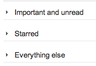

home: index.html
prev: views1.html
next: views3.html
---
# 13.Views - Behavior: binding DOM events to HTML and responding to events

In this chapter, I will discuss the things that need to happen in order to respond to user events:

*   attaching listeners to DOM nodes in the HTML in order to react to user events
*   handling cross-view communication
*   abstracting common behavior in views

## Different kinds of UI interactions

Additing interactivity is about taking a DOM event and responding to it by doing something in the model layer and the view layer. Let's look at a few different kinds of interactions using Gmail as an example, and see how they might affect the state of the application (e.g. the model/view layers).

<table>
<tr><td>

</td><td>
<p><b>Model data change.</b> Here, the user interaction results in a model property being set. For example, in Gmail, click a message to star it. This might result in message.starred being set to true. Assuming that the view layer receives change events from the model, any views showing that message can then update themselves.</p>

</td></tr>

<tr><td>



</td><td>

<p><b>Single view state change.</b> Here, it is less clear which model is associated with the change. For example, in Gmail, click a collapsible section to show/hide it. This is naturally expressed as a property of the view instance.</p>

</td></tr>

<tr><td>


</td><td>

<p><b>Multiple view state change.</b> In this case, we want a single action to influence multiple views. For example, in Gmail, change the compactness of the app display density. This will cause all views to adjust their display density, making them visually more compact.</p>

<p>There are two ways this might be implemented: by sending a transient message to which all views react, or by having a setting in the global scope that all views poll/subscribe to.</p>

</td></tr>

<tr><td>

</td><td>

<p><b>Page state transition.</b> What makes page state transitions different from the others is that it involves a wholesale change in the page. Views might be destroyed or hidden, and new views swapped in place of them. For example, in Gmail, click on "Compose" to start writing a new message, which loads up the message editor.</p>

</td></tr>

</table>


## Binding DOM events to the View

What the examples above try to show is that in order to respond to user actions, we need to do two things:

*   Listen to DOM events
*   Given the event, figure out what action makes sense

Listening to DOM events is all about the lifecycle of our view. We need to make sure that we attach the DOM listeners when the element containing the view is inserted into the DOM and removed when the element is removed. In essence, this requires that we delay event registration and make sure it each handler is attached (but only once), even if the view is updated and some elements within the view are discarded (along with their event handlers).

Figuring out what action makes sense is part app programming, part framework capabilities. Whether we are using model-backed views or markup-driven views, we still want to make the most common operations simple to do by providing access to the related information. The rest is app-specific.

## Options for specifying the event-to-handler relations

Since the DOM only has a element-based API for attaching events, there are only two choices:

*   DOM-based event bindings.
*   Framework-generated event bindings.

**DOM-based event bindings** basically rely on DOM properties, like the element ID or element class to locate the element and bind events to it. This is fairly similar to the old-fashioned $('#foo').on('click', ...) approach, except done in a standardized way as part of view instantiation. Here is an example:

```js
View.template = '<div>\
    <input type="checkbox" class="select">\
    \
    <a class="hide">Hide</a>\
  </div>';

View.events = {
  'click .select': function() {
    Emitter.emit('intent:message:select', this.model);
  },
  'click .toggleStar': function() { this.model.toggleStar(); },
  'click .hide': 'hide',
};
```

**Framework-generated event bindings** allow you to bind event handlers to HTML without explicitly providing a element ID or selector for the view. Here is an example:

```html
{{#view Foo}}
<div>
  <input type="checkbox"
    {{onclick="Emitter.emit('intent:message:select', this.model);"}}>
  
  <a {{onclick="this.hide();"}}>Hide</a>
</div>
{{/view}}
```

Both of these are obviously just ways to call the DOM API to add event listeners to elements. The difference is that DOM-selector-based event bindings can be implemented much more simply. The framework-generated event bindings require that the framework generates selectors to attach the event bindings, and that the metadata for what events to listen to and what to do needs to be extracted out of the template into metadata or a view object.

I find it fairly hilarious that we've basically come full circle: when JS launched, it began with onclick handlers inside HTML. Then people started hating on JS within HTML. And now, we're back to defining onclick handlers; except that now those onclick handlers actually get compiled into JS objects that represent the DOM that are managed by a framework.

Of course, things are a bit different on this iteration: the patterns used are more sophisticated, we pass a custom scope to the event handler, the bindings for the onclick handlers are more intelligent, and binding/unbinding events is handled by the framework. There is a certain declarativeness to writing onclick handlers this time around. But still, I find it funny.

## Implementing event bindings

There is a reason why many frameworks make a view represent a single element: it makes binding events a lot easier if you can instantiate the element early on. The initial render workflow looks something like this:

```js
var el, buffer, view;
if(rerender) {
  view.unBindEvents(el);
  destroyElement(el);
}
buffer = view.renderToBuffer();
el = view.attachToDom(buffer);
bindEvents(el);
```

I'm sorry I need to gloss over the details a bit, I will update this section later on. The gist of the render process is that views go through a number of states:

*   Not instantiated
*   Instantiated and rendered to buffer
*   Attached to the DOM
*   Destroyed

Event bindings need to keep track of the view's state to ensure that the events are bound when a DOM element exists (since the only way to bind events is to have a DOM element for it).

How would this look in terms of code? For DOM-based bindings, something like this:

```js
View.prototype.render = function() {
  var template = TemplateEngine.compile(this.template);
  template(this.data);
  this.attach(el, View.events);
};

View.prototype.attach = function(el, events) {
  events.forEach(function(selector) {
    var parts = selector.split(' ', 2),
        callback = events[selector];
    $(el).on(parts[0], parts[1], callback);
  });
};
```

Here, we are simply taking `View.events` which is presumed to be a hash of event selectors and their associated callbacks, and using jQuery to attach those events.

The implementation is essentially identical for the framework-generated bindings. Instead of using CSS classes, the event selectors are based on the markup that the template engine generated. The only difference is that the hash of event selectors comes from the templating engine rather than from the View object:

```js
View.prototype.render = function() {
  var meta = TemplateEngine.compile(this.template);
  meta.template(this.data);
  this.attach(el, meta.events);
};

View.prototype.attach = function(el, events) {
  // ... see above
};
```
